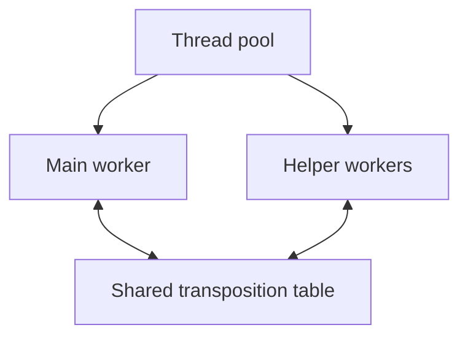

# Architecture

Latrunculi is a C++23 UCI chess engine with bitboard move generation,
handcrafted evaluation, and multithreaded principal variation search (PVS).

## Source layout

| Directory | What you'll find |
| --- | --- |
| [core](../src/core/) | Chess types, bitboards, and attack tables |
| [board](../src/board/) | Position state, make/unmake, rules, FEN, and notation |
| [movegen](../src/movegen/) | Pseudo-legal move generation and perft |
| [eval](../src/eval/) | Static evaluation, weights, and tuning features |
| [search](../src/search/) | Search, move ordering, the transposition table, limits, and threads |
| [uci](../src/uci/) | GUI commands, engine options, and search output |
| [cli](../src/cli/) | Command-line entry point, benchmark, and feature export |

## Positions and moves

[Board](../src/board/board.hpp) stores the position and the history needed
to undo moves.

- Pieces are stored in bitboards and an array indexed by square.
- Sliding-piece attacks use
  [magic bitboard](https://chessprogramming.org/Magic_Bitboards) tables in
  [attacks_magic.cpp](../src/core/attacks_magic.cpp).
- Make/unmake uses a stack of saved states, updating the Zobrist key and
  cached evaluation terms as pieces move.
- `Board` also handles castling, en passant, and draw detection.

[Generator](../src/movegen/generator.hpp) produces pseudo-legal moves,
and `Board` checks their legality. Search and perft use the same move
generation and make/unmake code.

## Evaluation

The handcrafted [Evaluator](../src/eval/evaluation.cpp) uses tunable weights:

- `Board` keeps material and piece-square scores up to date during make/unmake.
- The evaluator adds scores for pawn structure, piece activity, mobility,
  threats, and king safety.
- [Tapered evaluation](https://chessprogramming.org/Tapered_Eval) blends
  middlegame and endgame scores based on the remaining non-pawn material.
- It also applies endgame scaling and a tempo bonus.

The same evaluator exports features for the
[tuning tools](../tools/tuning/README.md), which fit linear weights from
recorded games.

## Search

[Worker](../src/search/worker.hpp) handles search setup, limits, and results.
Its search algorithm lives in [algorithm.cpp](../src/search/algorithm.cpp)
and uses:

- **Iterative deepening:** Each iteration starts with an
  [aspiration window](https://chessprogramming.org/Aspiration_Windows) around
  the previous score. If the result falls outside that window, the search
  widens it and tries again.
- **[Principal variation search](https://chessprogramming.org/Principal_Variation_Search):**
  At PV nodes, the first legal move gets a full alpha-beta window;
  later moves get a zero-window search and are searched again with the full
  window if they improve alpha.
- **Late move reductions:** Search later moves at a lower depth, then repeat
  at full depth if they improve alpha.
- **Null-move pruning:** Pass the turn in a reduced-depth search and cut off
  if the score still reaches beta.
- **Futility pruning:** Skip non-checking quiet moves at shallow depths when
  static evaluation plus a margin cannot improve alpha.
- **Move ordering:** The staged [Picker](../src/search/ordering/picker.hpp)
  tries the transposition-table move and promising captures, then uses killers,
  countermoves, and history scores for quiet moves. Capture ordering uses static
  exchange evaluation (SEE).
- **Quiescence:** At the depth limit, search continues through SEE-filtered
  captures and promotions, or all legal evasions when in check.

## Parallel search

[ThreadPool](../src/search/thread_pool.hpp) runs a main worker and optional
helpers as threads in the same process. The UCI [Engine](../src/uci/engine.hpp)
keeps reading commands while they search, so it can respond to `stop`.

The workers use [Lazy SMP](https://chessprogramming.org/Lazy_SMP): each
searches the same root position with its own `Board`, root lines, and
move-ordering state, while sharing the transposition table. Helpers stagger
their search depths to reduce duplicated work. The main worker stops the
helpers and chooses which result to report.

Results go through the [Reporter](../src/search/reporter.hpp) interface.
[Writer](../src/uci/writer.hpp) implements it for UCI output; benchmarks and
tests use their own reporters.

## Tests and tools

The [test suite](../tests/) includes unit tests organized by module and
randomized stress tests. The [analysis tools](../tools/analysis/README.md)
provide search benchmarks and UCI inspection; the
[tuning tools](../tools/tuning/README.md) handle evaluation data and weight
fitting. Build and test commands are in the [README](../README.md#development).
